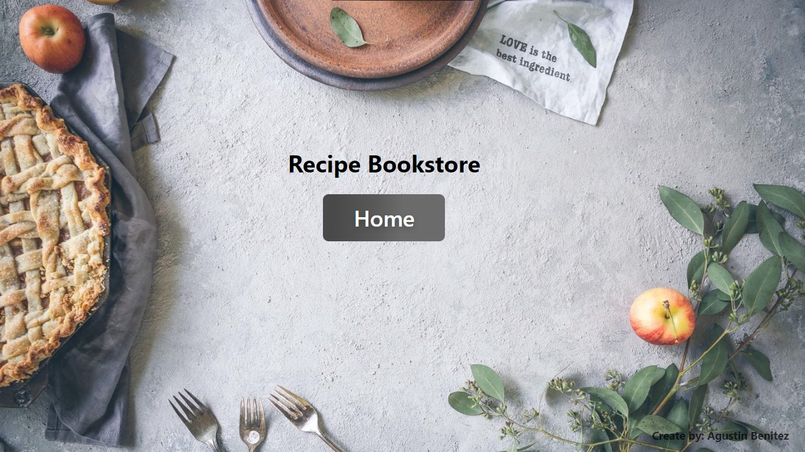
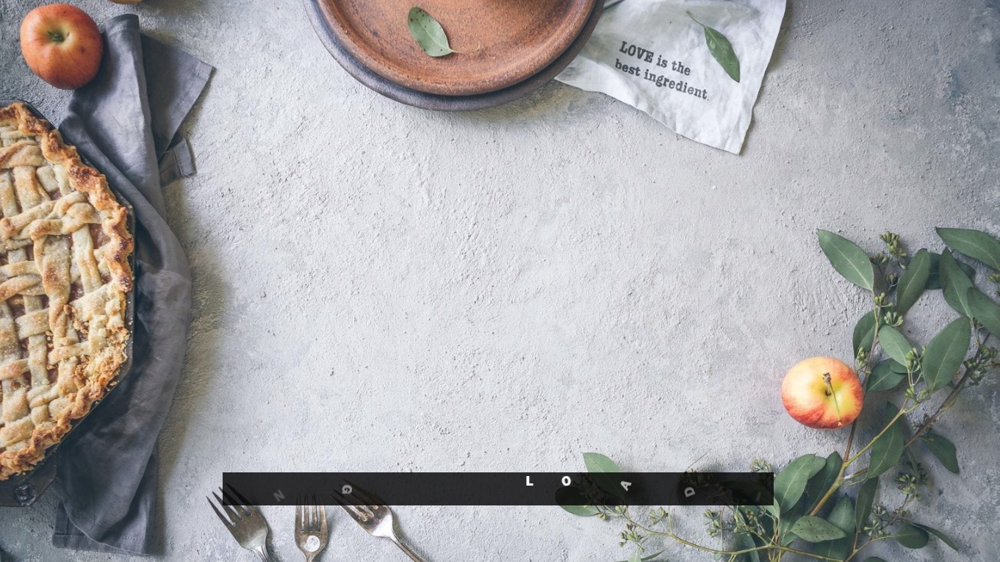
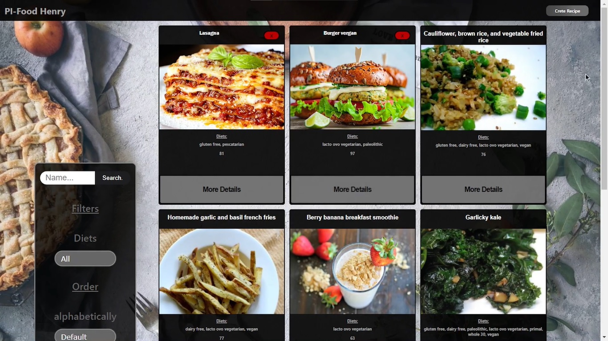

<h1>Hola Soy Agustin Benitez</h1>
  

 Full Stack Developer con formación como Desarrollador 
Web. Experiencia trabajando en NodeJS, React, Redux, 
SQL entre otras tecnologías del sector. Lidere la 
creación de una aplicación de inmobiliaria para alquilar 
y vender propiedades para una mayor optimación y 
gestión de trabajo. Con resolución de problemas, 
trabajo en equipo, comunicación, autonomía y 
pensamiento lógico.

<h2 align="left">🖥Mis Proyectos:</h2>

<h3>📌Book food's:</h3>

Aplicación realizada de cero utilizando, React-Redux, HTML, CSS puro, SQL postgres, Sequelize.

Esta aplicación fue creada desde cero, base de datos, back-end, front-end.

  
funcionalidades:Crear recetas a través de un formulario controlado, filtrar por dietas, Ordenar alfabéticamente o nivel de saludable, Eliminar Recetas creadas, Buscar Receta

Api utilizada: https://www.spoonacular.com/ 
Video Youtube: https://www.youtube.com/watch?v=gUPLw4EThp4
           
 <a href="https://github.com/Bezagus/PI-Food-Agustin-Benitez.git">
 
 
 

<h3>📌Henry Bienes Raices:</h3>

Este proyecto fue creado en conjunto con un grupo de 8 integrantes, el proyecto está basado en una plataforma para la realización de compras, alquileres y propuestas de venta en el ámbito de bienes raíces.
En la plataforma encontraras opciones como filtrado de propiedades, una sección de favorito, una posibilidad de loguearte, enviar datos de tu casa para que la inmobiliaria venda tu casa.

Video Youtube:https://www.youtube.com/watch?v=Y2hWncYXqjQ  
Repositorio: https://github.com/enzoulloa/proyecto-final.git

<h2 align="left">Conéctate conmigo:</h2>

Mail: agustinbenitez1@gmail.com  
  
  

  

<h2 align="left">Lenguajes y herramientas:</h2>

 
 

 
 
 
 
 
 
 
 
 
 
 
 
 

&nbsp;

