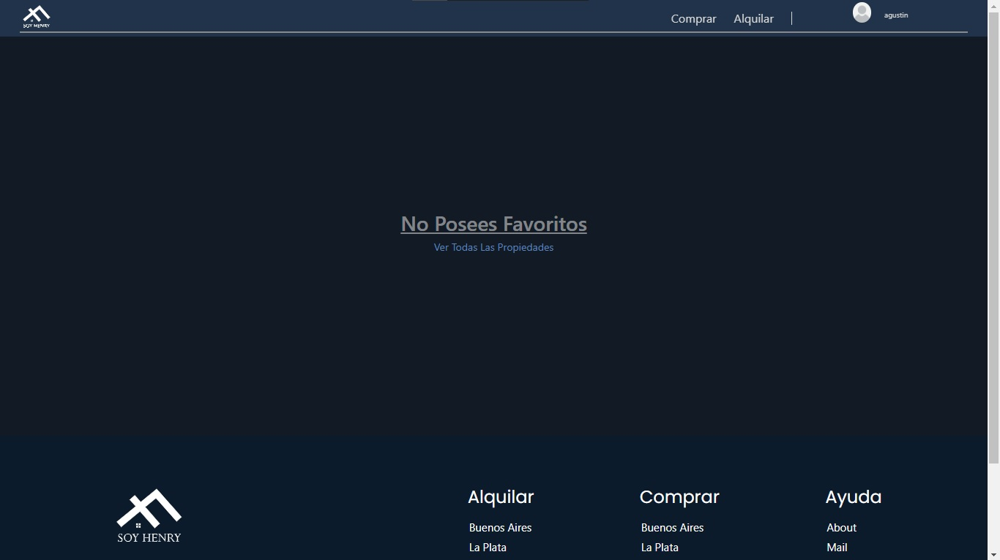
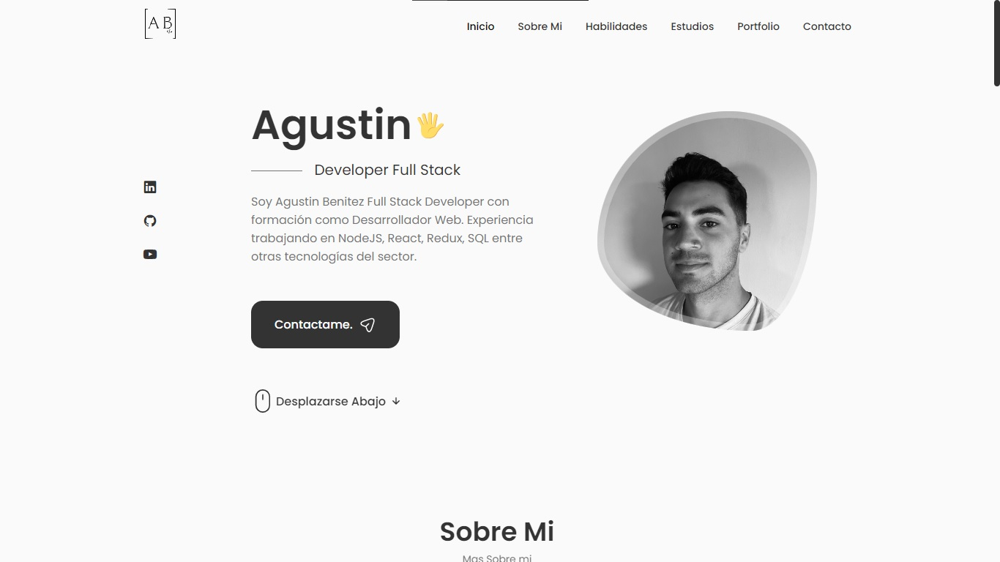
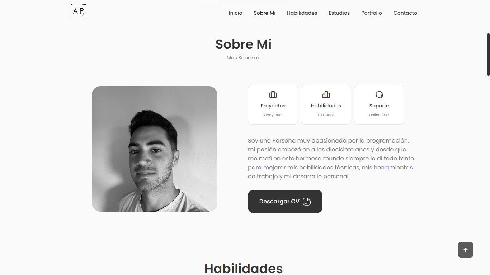
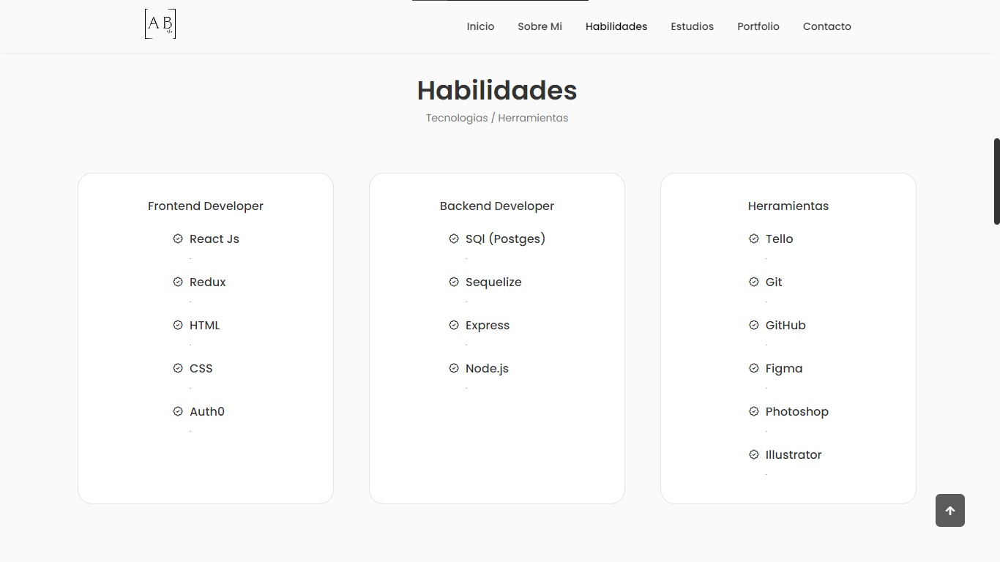
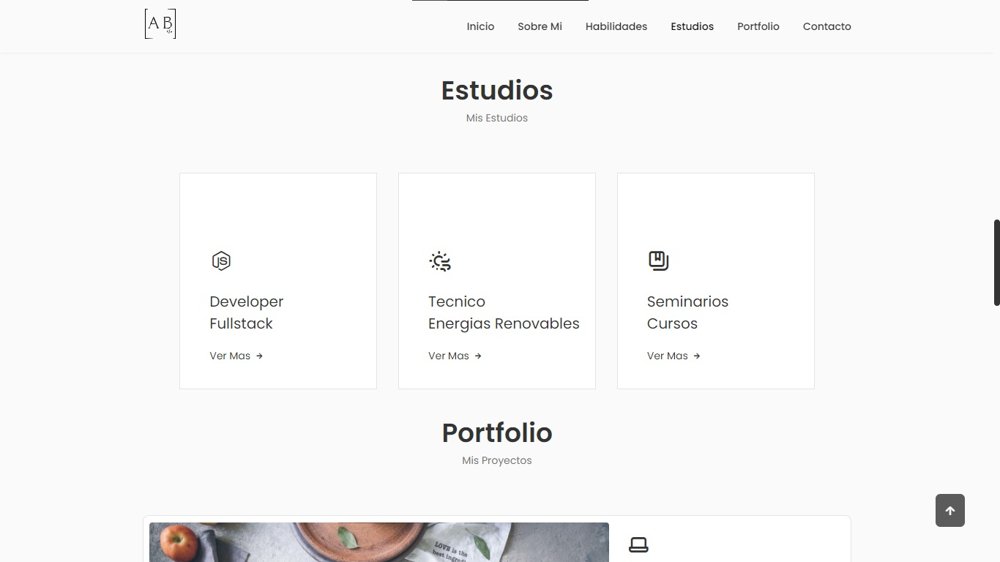
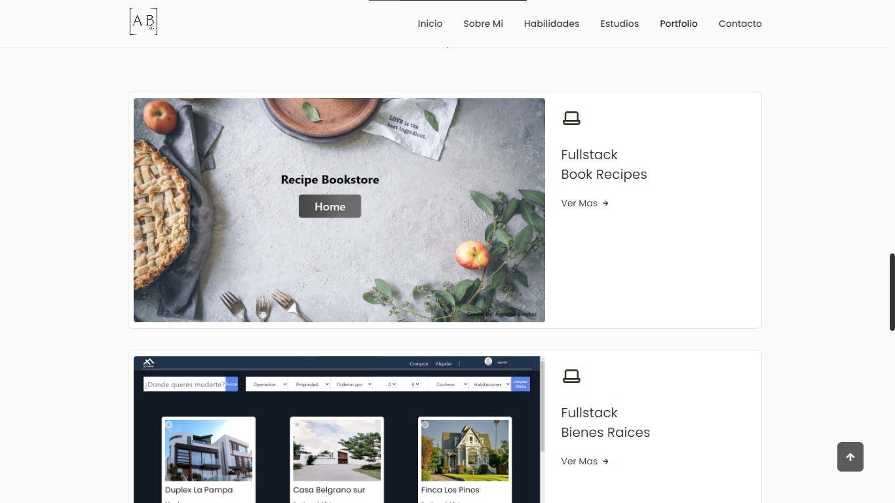
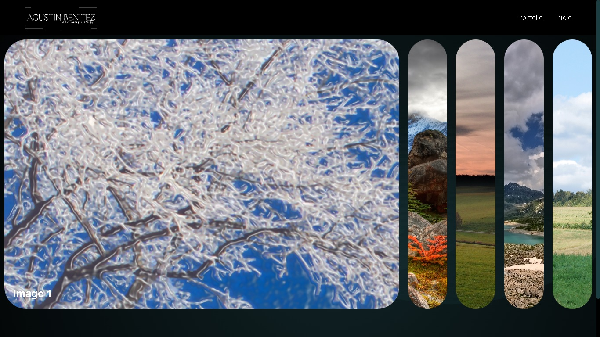
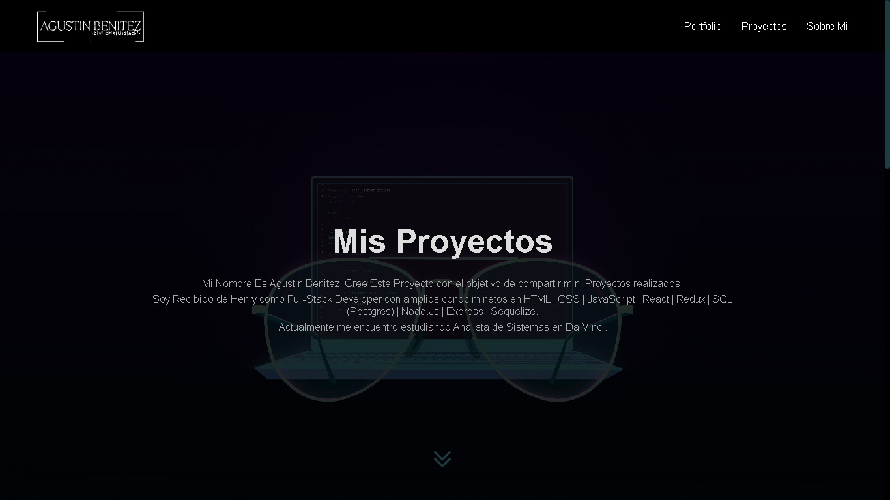
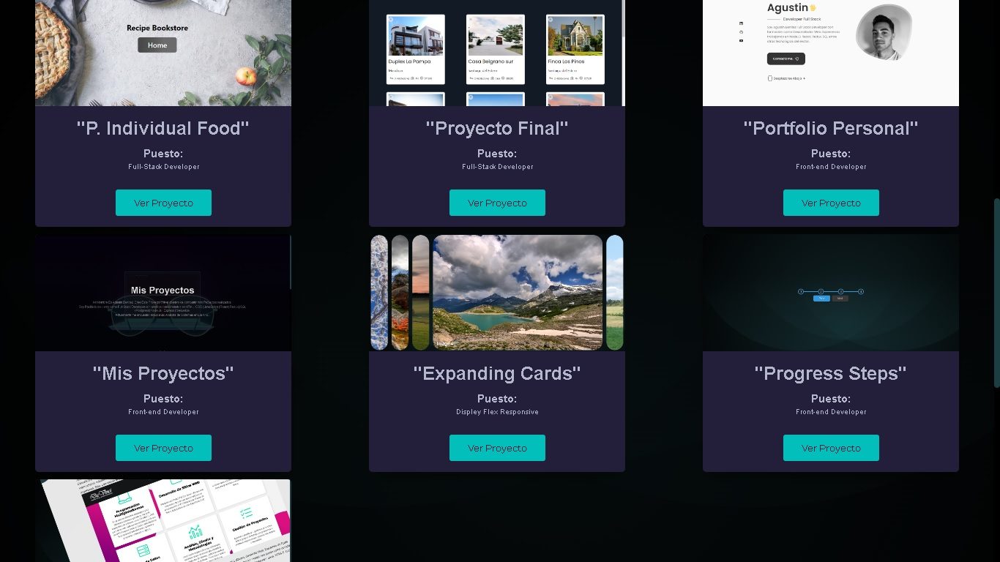
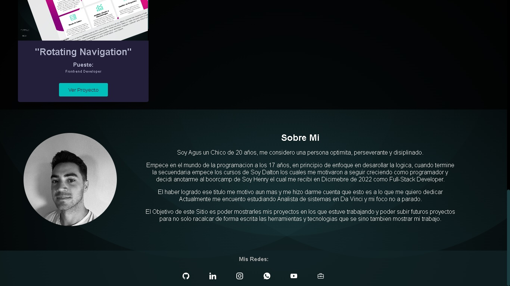

<h1>Hi, My fullname is Agustin Benitez.</h1>
  

 
Software developer | Data Science and Artificial Intelligence, I have experience in JavaScript with libraries such as React, Redux, Node.js, Express, and in Python with libraries such as Pandas, NumPy, Matplotlib, Seaborn, pip.

I also have experience using Git, virtual environments with Anaconda and Mamba, Illustrator, and Photoshop.

Currently, I am studying the Artificial Intelligence career at Platzi, and next year, I will start a degree in Systems Engineering.

I have experience in 4 individual projects, including a recipe library, a weather app, a personal portfolio, and a project portfolio. I also have experience in a group project with 7 members, where we developed a real estate application for buying and renting properties.

I also developed a website for a company called Patagonia Paradise, which aimed to showcase and sell fishing services to foreign visitors from the United States.

  

My most notable soft skills are teamwork, open-mindedness, determination, and sociability.

<h2 align="left">🖥Highlighted Projects:</h2>

- Data Science and Artificial Intelligence (Platzi)-2023

Currently, I am studying Artificial Intelligence at Platzi and preparing to enroll in a Systems Engineering program.

- Full-Stack (Soy Henry)-2022

A bootcamp of over 700 hours, consisting of both practical and theoretical components.

- HTML y CSS (Google Active)-2020

I took a Google course where I learned HTML5 and CSS3.

- Graphic Design(Edutin)-2020

I took a Graphic Design course in Photoshop and Illustrator.

- Personal Productivity(Google)-2020

Google offers a course that teaches techniques to enhance productivity and efficiency.

<h2 align="left">🖥Highlighted Projects:</h2>

<h3>📌Book food's:</h3>

Application built from scratch using React-Redux, pure HTML, CSS, SQL with Postgres, and Sequelize.

This application was created from scratch, including the database, back-end, and front-end.

Functionalities: Creating recipes through a controlled form, filtering by diets, sorting alphabetically or by health level, deleting created recipes, and searching for recipes

Api utilizada: https://www.spoonacular.com/ 
Video Youtube: https://www.youtube.com/watch?v=gUPLw4EThp4
           
 <a href="https://github.com/Bezagus/PI-Food-Agustin-Benitez.git">
 
 
 

<h3>📌Henry Real Estate:</h3>

This project was created in collaboration with a group of 8 members. The project is based on a platform for buying, renting, and selling properties in the real estate domain.
On the platform, you will find options such as property filtering, a favorites section, the ability to log in, and the option to submit your house details for the real estate agency to sell your house.

Video Youtube:https://www.youtube.com/watch?v=Y2hWncYXqjQ  
Repositorio: https://github.com/enzoulloa/proyecto-final.git

<h3>📌Portfolio:</h3>

This project is created with the aim of enhancing my personal brand and allowing companies or users to see my work. The project is fully responsive, ensuring compatibility across different devices 
 
Technologies Used: 
 .JavaScript 
 .React JS 
 .HTML 
 .CSS 
 .React Icon 
 .Email Js 
 
Libraries: 
 .IconScout 
 .Iconbox

 
 Repository: https://github.com/Bezagus/Portfolio.git

<h3>📌Portfolio Proyects:</h3>

This project is created with the objective of showcasing my work and the projects I have completed, ranging from simple to more complex ones. The aim is not only to describe what I can do but also to provide an interactive experience for users to explore. The project is also fully responsive, ensuring a seamless experience across different devices.

Link: https://agustin-benitez-proyectos.vercel.app/  
Repositorio: https://github.com/Bezagus/Portfolio-Proyects

<h2 align="left">👤 Connect with me:</h2>

Mail: agustindavidbenitez1@gmail.com
<h2 align="left">👨‍💻 Technologies and Tools:</h2>

 
 
 

 
 
 
 
 

  
  
  

 
 
 
 
 

 
 

